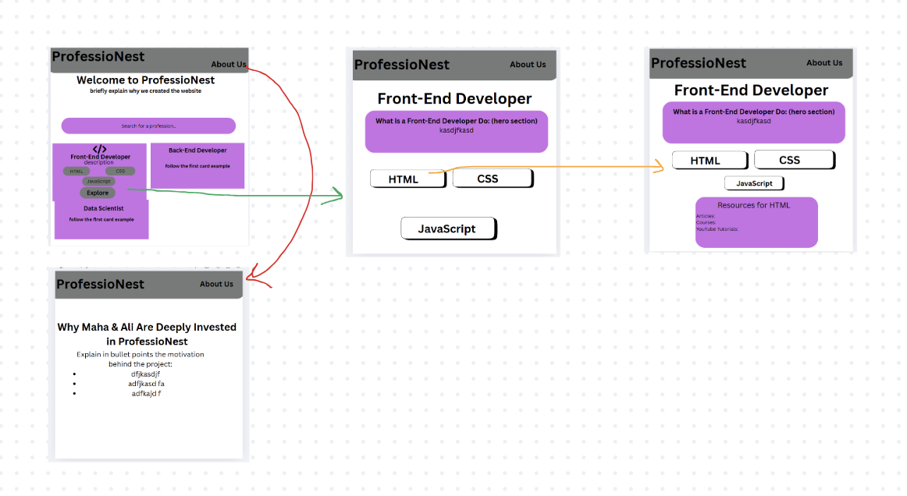

# ProfessioNest

ProfessioNest is a centralized platform that helps learners tailor their study habits and resource discovery based on their career goals. By organizing study materials by field and skill, it empowers users to focus on their aspirations without wasting time searching for relevant tools.

---

## Table of Contents
* [Overview](#overview)
* [Product Spec](#product-spec)
* [Wireframes](#wireframes)
* [Schema](#schema)
* [UI Progress](#ui-progress)

---

## Overview
### Description (Business Thesis)
ProfessioNest enables learners to align their study habits with their future career goals by providing centralized access to curated, field-specific resources. The app reduces the time and friction involved in finding the right tools, making learning more efficient and motivating.

### Customer Discovery
#### Customer Segments:
* High school seniors planning their academic journey
* College students seeking career alignment
* Career-changers and lifelong learners
* Parents guiding their children’s education

#### Problems Identified
* Fragmented access to study materials and career resources
* Difficulty mapping skills to career pathways
* Low motivation caused by overwhelming information overload

### Revenue Model
Freemium: Core features are free. Premium features (like personalized roadmaps or community mentorship) may be introduced later.

---

## Product Spec
### Features:
* Users can explore a variety of careers displayed as clickable cards.
* Clicking a career card leads to skill-specific resources.
* Skill cards provide curated study advice and learning links.
* A clear and consistent navigation bar links key pages.
* An "About Us" section details the mission and creators.

### User Stories
* As a career-oriented individual, I can explore resources that align with my goals.
* As a user, I can learn about the creators and the app's mission on the About Us page.
* As a learner, I can browse careers → see relevant skills → access targeted resources for each skill.

### Screen Archetypes
* Home View: Browse career fields through visual cards
* Career Skills View: See relevant skills for a selected career
* Skill Resources View: Display curated study materials
* About Us Page: Learn about the creators and the app’s mission
* Navigation Bar: Navigate between views easily

### Navigation Flow
* Home → Click Career → Click "Explore" → Click Skill → Access Resources
* Home → About Us
* Navigation Bar accessible from all views

---

## Wireframes

---

## Schema
### Models
| Property | Type | Description |
| :------- | :--- | :---------- |
| CareerField | Text | Selected job domain (e.g., Front-End Developer)
| SkillName | Text | Relevant skill for the selected career

### Networking 
* **API Endpoint**: `/api/v1/:career`
* **Returns**: Skill list with associated resources for the selected career

---

## UI Progress
* Home layout with dynamic career cards ✅
* React Router views for skills and resources ✅
* Modular resource cards with links and descriptions ✅
* PostgreSQL schema loaded with structured resource data ✅
* Express API for backend filtering ✅
* About Us component with mission and creator bios ✅
* Styling improvements in progress 🎨
* Accessibility and responsiveness enhancements pending 📱

---